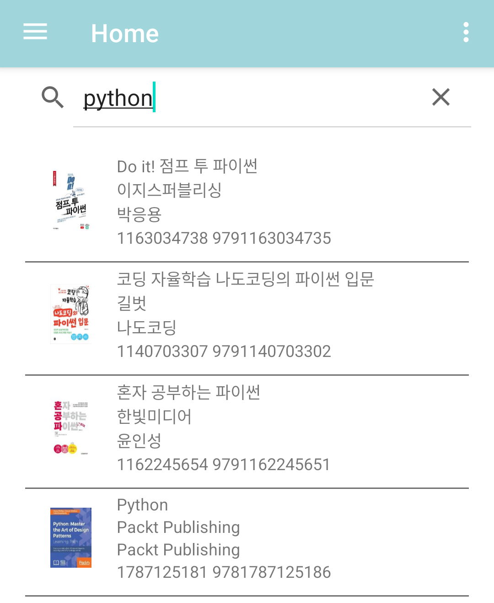
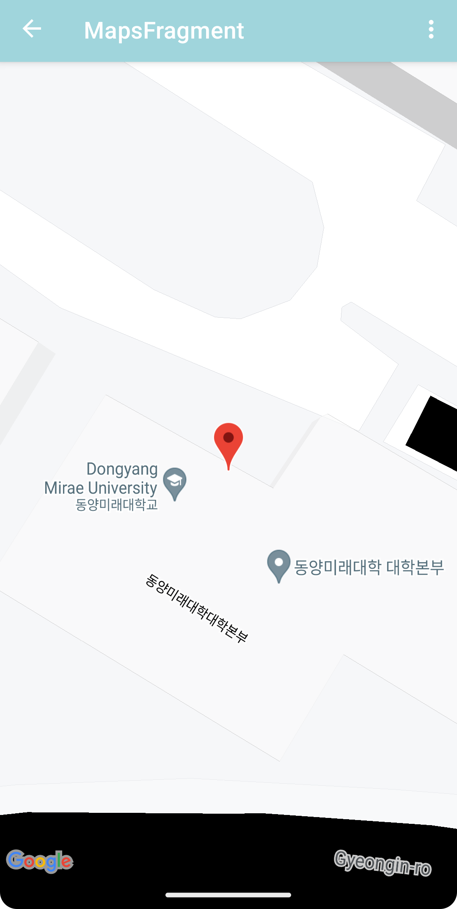
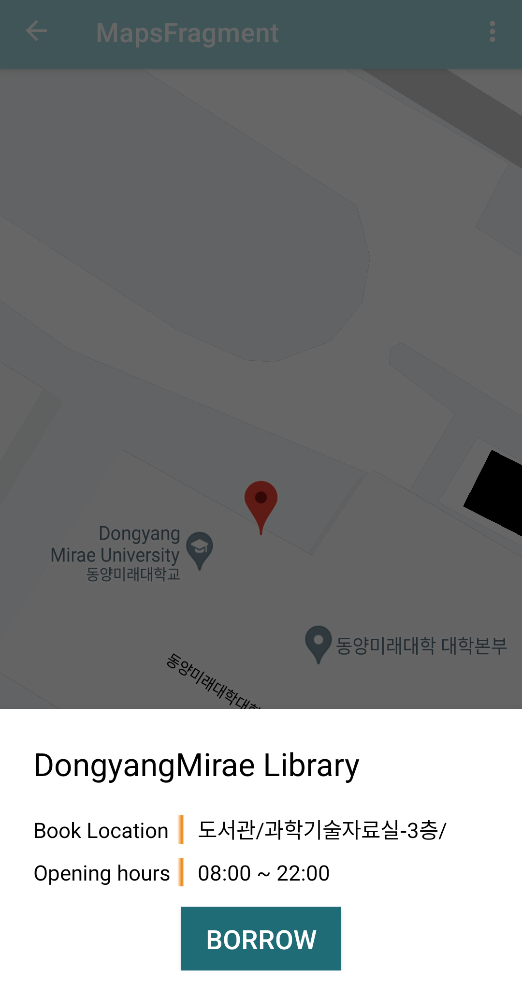
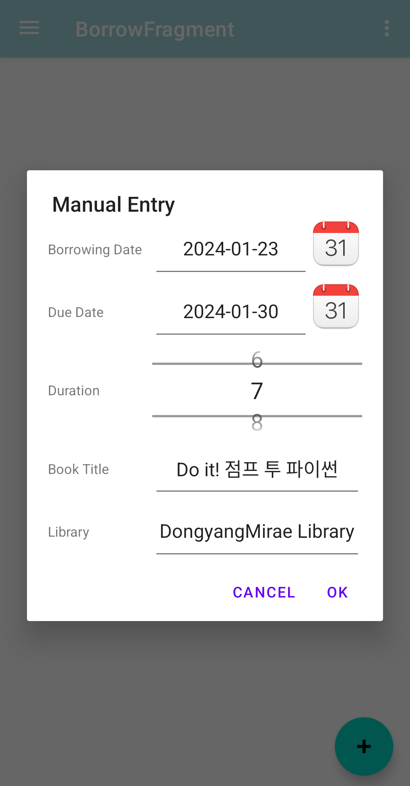

# 북레이더 (BookRadar)

## 개요

https://github.com/larpios/BookRadar/assets/33772093/21f31eca-d53c-4863-bcec-e8fb4b2f6af5

원하는 도서를 가까운 도서관에서 빌릴 수 있는지 확인하기 위해선 번거로운 작업을 거쳐야 합니다. 근처 도서관을 검색하고, 그 도서관 사이트에서 도서을 조회해서 대출이 가능한지 확인해야 합니다. 저희는 이 성가신 일을 간편하게 만들고 싶었습니다.

북레이더는 사용자가 원하는 도서을 검색하면 해당 도서가 어느 도서관에 있는지 즉시 알려주어, 효율적으로 도서을 빌릴 수 있게 도와줍니다.

## 누가 쓸 수 있는가

사용자가 도서을 빌리고 싶을 때, 언제 어디서나 앱을 이용해서 현재 대출 가능한 가까운 도서관을 찾고 싶을 때 이용할 수 있습니다.

## 기능

### 도서 검색 기능

도서를 검색할 수 있습니다.

[Kakao API](https://developers.kakao.com/docs/latest/ko/daum-search/dev-guide#search-book)를 이용합니다.

### 도서 상세 정보

도서에 대한 상세 정보를 확인할 수 있습니다. 우측 하단에 버튼을 눌러 해당 도서가 있는 도서관을 검색합니다.

### 도서관 검색

구글 맵 뷰에서 도서를 가지고 있는 도서관을 볼 수 있습니다.

마커를 누르면 도서관의 정보와 해당 도서의 위치를 알 수 있습니다. 책을 빌린 후 빌리기 버튼을 눌러 내용을 기록할 수 있습니다.

### 빌린 책 정보 기록

도서를 빌린 후 빌린 정보를 기록할 수 있습니다. 내용이 자동으로 입력되며, 정확하지 않은 내용이 있으면 직접 수정할 수 있습니다.

수동으로 직접 입력하고 싶다면 내비게이션 드로워를 통해 해당 프래그먼트로 이동해서 +버튼을 눌러 직접 추가할 수도 있습니다.
